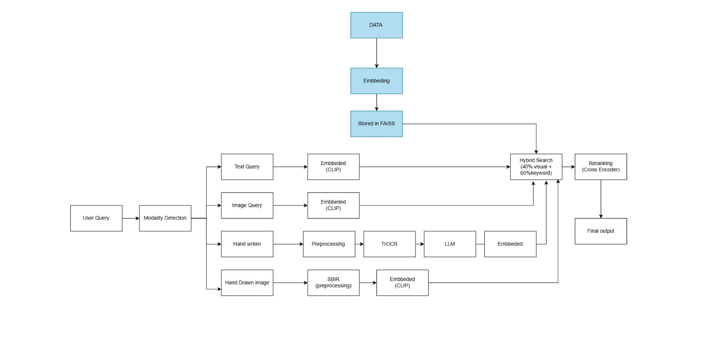

# 💎 JewelUX: Next-Gen Multimodal Jewelry Search

JewelUX is a premium, AI-driven jewelry recommendation system that redefines how users discover luxury items. By combining state-of-the-art Computer Vision (**CLIP**) with lightning-fast vector search (**FAISS**), JewelUX enables a truly multimodal search experience—find your perfect piece through text, images, hand-drawn sketches, or even handwriting.

## ✨ Key Features

- **🌈 Multimodal Search Engine**: 
  - **Text-to-Image**: Describe what you want ("Gold necklace with rubies").
  - **Image Similarity**: Upload a photo to find visually matching jewelry.
  - **Sketch-to-Item (SBIR)**: Draw a rough sketch and see it come to life.
  - **Handwriting Search**: Upload a handwritten note or tag to search for specific items.
- **� Real-time Market Ticker**: Live simulated rates for Gold, Silver, and Diamonds directly in the header.
- **✨ Liquid Gold UI**: A high-end aesthetic featuring glassmorphism, holographic interactions, and custom "Aura Cursor" tracking.
- **🏷️ Dynamic Smart Tags**: Automatically generated search suggestions based on current inventory metadata.
- **🔍 Deep Insights**: Interactive product modals with similarity-based recommendations.

## 🛠️ Technical Stack

### **Backend (Python / FastAPI)**
- **AI Engine**: [OpenAI CLIP](https://github.com/openai/CLIP) for cross-modal embeddings.
- **Vector Database**: [Meta FAISS](https://github.com/facebookresearch/faiss) for high-performance similarity search.
- **OCR**: Handwriting recognition module for extracting search intent from images.
- **Search Logic**: Hybrid retrieval system combining semantic vector scores with BM25-inspired keyword ranking.

### **Frontend (React / Vite)**
- **Styling**: [Tailwind CSS](https://tailwindcss.com/) for a modern, responsive design system.
- **Animations**: [Framer Motion](https://www.framer.com/motion/) for fluid transitions and interactive components.
- **Networking**: Axios for seamless API integration with the FastAPI backend.

## 🚀 Getting Started

### Prerequisites
- Python 3.9+ 
- Node.js 18+
- Recommended: NVIDIA GPU with CUDA for faster inference (optional).

### Setup & Installation

1. **Clone the Repository**
   ```bash
   git clone https://github.com/GiriPrasathGA/Multimodal-Jewelry-Recommendation-System.git
   cd Multimodal-Jewelry-Recommendation-System
   ```

2. **Backend Setup**
   ```bash
   cd backend
   python -m venv .venv
   # Windows:
   .\.venv\Scripts\Activate.ps1
   # Linux/macOS:
   source .venv/bin/activate
   
   pip install -r requirements.txt
   ```

3. **Frontend Setup**
   ```bash
   cd ../frontend
   npm install
   ```

### Running the Application

You need two terminal instances:

**Terminal 1: Backend**
```bash
cd backend
python run.py
```
*Runs on `http://localhost:8000`*

**Terminal 2: Frontend**
```bash
cd frontend
npm run dev
```
*Runs on `http://localhost:5173`*

## 🗺️ Project Structure



```text
├── assets/                   # Documentation assets (Architecture, UI, etc.)
├── backend/                  # FastAPI Application Root
│   ├── data/                 # Raw jewelry image dataset
│   ├── embeddings/           # Pre-computed FAISS vector indices
│   ├── metadata/             # item.csv and processed metadata
│   ├── scripts/              # Data ingestion and indexing scripts
│   ├── utils/                # AI logic (CLIP, OCR, Hybrid Search)
│   ├── main.py               # API Endpoints and logic
│   ├── requirements.txt      # Python dependencies
│   └── run.py                # Server entry point
│
├── frontend/                 # React (Vite) Application Root
│   ├── src/
│   │   ├── components/       # UI Modules (AuraCursor, ResultsGrid, etc.)
│   │   ├── assets/           # Static images and icons
│   │   ├── App.jsx           # Application state and search logic
│   │   ├── index.css         # Global styles and Tailwind imports
│   │   └── main.jsx          # React entry point
│   ├── index.html            # HTML template
│   ├── package.json          # Node.js dependencies
│   └── tailwind.config.js    # Tailwind CSS configuration
│
└── README.md                 # Project documentation
```

---
*Built as a Capstone Project for RAG & Multimodal AI.*